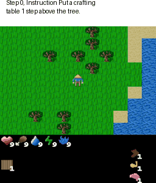
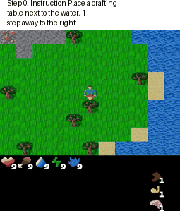
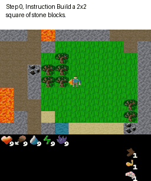

# CrafText Benchmark: Advancing Instruction Following in Complex Multimodal Open-Ended World

**CrafText** is a goal-conditioned extension of the [Craftax environment](https://github.com/MichaelTMatthews/Craftax), designed as a benchmark for **multimodal reinforcement learning**. It enables agents to follow natural language instructions grounded in rich, visual environments inspired by Minecraft, combining vision and language to guide complex action sequences.

## ✨ Key Features

* **Natural Language Objectives**
  Agents are driven by instructions such as “place a crafting table near a tree” or “build a square with stone blocks,” requiring them to reason over both spatial layouts and object interactions.

* **Diverse Scenario Library**
  Tasks are defined in [`CrafText/craftext/dataset/scenarious`](CrafText/craftext/dataset/scenarious), offering a wide range of instruction types and complexities—from basic object placement to multi-step crafting chains.

* **Automated Instruction Checkers**
  Each task includes a custom checker located in [`craftext/environment/scenarious/checkers`](CrafText/craftext/enviroment/scenarious/checkers), which programmatically verifies whether the agent has fulfilled the specified goal.

* **Environment Integration Layer**
  The wrapper in [`craftext_wrapper.py`](CrafText/craftext/enviroment/craftext_wrapper.py) enriches the base environment with dynamic goal injection and success feedback.

## Visual Examples

| Place Crafting Table Near Tree | Place Crafting Table Near Water  | Make Square of Stone       |
| ------------------------------ | -------------------------------- | -------------------------- |
|  |  |  |


## Installation

1. Clone the repository.
2. Create a virtual environment and install the dependencies from `requirements.txt`:

   ```bash
   conda create --name craftext python=3.9
   conda activate craftext
   pip install -r requirements.txt
   ```

3. Navigate to the repository and install the dataset:

   ```bash
   cd CrafText
   pip install -e .
   ```


## 🧪 Basic Usage


```python
from craftext.enviroment.craftext_wrapper import InstructionWrapper
from craftext.dataset.scenarious import ScenariousManager
from craftext.models.encode import DistilBertEncode, EncodeForm

import jax
import jax.numpy as jnp

# Step 1: Create Craftax environment
env: CraftaxClassicPixelsEnv = make_craftax_env_from_name(
    "Craftax-Classic-Pixels-v1", 
    auto_reset=False
)

# Step 2: Wrap with CrafText
wrapper = InstructionWrapper(
    env=env,
    config_name='simple',
    scenario_handler_class=ScenariousManager,
    encode_model_class=DistilBertEncode,
    encode_form=EncodeForm.EMBEDDING
)

# Step 3: Reset and interact
seed = jax.random.PRNGKey(0)
env_params = env.default_params

obs, state = wrapper.reset(seed, env_params)

action = jnp.array(0, dtype=jnp.int32)
obs, state, reward, done, info = wrapper.step(seed, state, action, env_params)

# Get the instruction embedding
instruction_emb = state.instruction

# Get the natural language instruction
dx = state.idx
instruction = wrapper.scenario_handler.all_scenario.instructions_list[idx]
```

## CrafText task type and configs 
| Task Type                                       | Easy | Medium | Hard |
| ----------------------------------------------- | :--: | :----: | :--: |
| `build`                                         |      |   ✅   |  ✅  |
| `conditional_achievements`                      |  ✅   |   ✅   |      |
| `conditional_placing`                           |      |   ✅   |  ✅  |
| `localization_placing`                          |      |   ✅   |  ✅  |

All possible configs you can find in `craftext/dataset/config`


## Citation

If you use CrafText in your research, please cite:

```bibtex
@article{volovikova2025craftext,
  title={CrafText Benchmark: Advancing Instruction Following in Complex Multimodal Open-Ended World},
  author={Volovikova, Zoya and Gorbov, Gregory and Kuderov, Petr and Panov, Aleksandr I and Skrynnik, Alexey},
  journal={arXiv preprint arXiv:2505.11962},
  year={2025}
}
